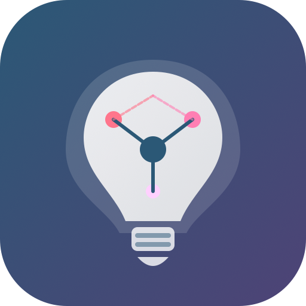

  

# Smart Area Lights for Home Assistant

**Smart Area Lights** is an advanced custom integration for Home Assistant that solves the limitations of the native "Light Group" platform. It intelligently aggregates and synchronizes your lights based on Home Assistant **Areas** and **Labels**.

Unlike the native groups, it correctly handles mixed-capabilities lights (RGB, Color Temperature, Dimmable, ON/OFF) without throwing errors, properly calculates averages by ignoring incompatible lights, dynamically listens to your Zigbee/Wi-Fi mesh for newly discovered devices, and includes smart-dimming logic (adjusting brightness won't wake up sleeping bulbs in the same room).

## ✨ Features

- 🏠 **Area-Based Auto-Grouping**: Select an Area (e.g., Living Room), and it will automatically group all lights inside it. No need to update the group when you add a new bulb to the room!
- 🏷️ **Label Filtering**: Want to group only the "Ceiling" lights in the Living Room? Just add a label to them, and select it in the setup menu.
- 🧠 **Smart Capability Mixing**: Mix simple ON/OFF relays with advanced RGB strips. The integration mathematically protects your Home Assistant logs from unsupported capability spam.
- 🌙 **Smart Dimming**: If only one lamp is turned on in the room, adjusting the group's brightness/color will only affect the currently lit lamp, keeping the others off.
- ⚡ **Dynamic Discovery Ready**: Automatically detects when Zigbee2MQTT or ZHA finishes loading devices after startup.

## 📥 Installation

### HACS (Recommended)
1. Open HACS in Home Assistant.
2. Click the three dots in the top right corner and select **Custom repositories**.
3. Add the URL of this repository: `https://github.com/noem-9C9/smart-area-lights`
4. Select category: **Integration**.
5. Click **Add**, then search for "Smart Area Lights" and click Download.
6. Restart Home Assistant.

### Manual Installation
1. Download the `smart_area_lights` folder from this repository.
2. Copy it into your `custom_components/` directory in Home Assistant.
3. Restart Home Assistant.

## ⚙️ Configuration

This integration supports **Config Flow** (Setup via the UI).

1. Go to **Settings** > **Devices & Services**.
2. Click **+ Add Integration** in the bottom right corner.
3. Search for **Smart Area Lights**.
4. Select the Area you want to group, and optionally filter by Label.
5. The integration will instantly create a new Light Entity (e.g., `light.group_auto_living_room`).

You can dynamically change the settings (enable/disable RGB or Brightness support) directly via the integration's **Configure** button at any time.
